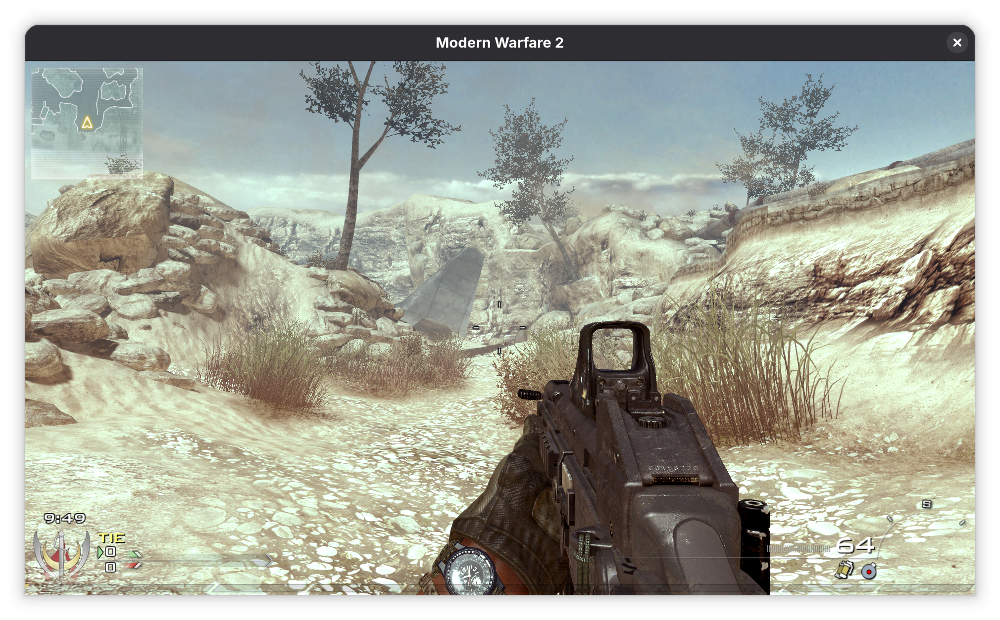

# IW4x

A client for Call of Duty: Modern Warfare 2, targeting Microsoft re-release.

## Overview

This repository contains the IW4x client implementation:

- **[libiw4x](libiw4x/)**
- **[libiw4x-utility](libiw4x-utility/)**

## Contributing

We welcome contributions! Please see our contributing guidelines for more information on how to get involved.

## License

This project is licensed under the GNU General Public License v3.0 or later. See [LICENSE.md](LICENSE.md) for details.
